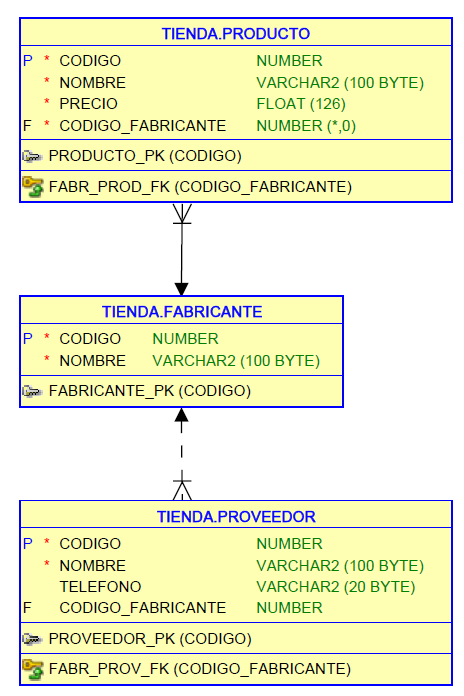

# Curso consultas SQL de Oracle

Curso para aprender a realizar consultas SQL usando Oracle.

NOTA: Curso en construcción

## Diagrama base de datos



Tambien lo tienes en [PDF](diagrama-base-de-datos-tienda.pdf)

## Script Base de datos

``` sql
DROP TABLE proveedor CASCADE CONSTRAINTS;
DROP TABLE producto CASCADE CONSTRAINTS;
DROP TABLE fabricante CASCADE CONSTRAINTS;

CREATE TABLE fabricante (
  codigo NUMBER PRIMARY KEY,
  nombre VARCHAR(100) NOT NULL
);

CREATE TABLE producto (
  codigo NUMBER  PRIMARY KEY,
  nombre VARCHAR(100) NOT NULL,
  precio FLOAT NOT NULL,
  codigo_fabricante INT NOT NULL,
  CONSTRAINT fabr_prod_FK FOREIGN KEY (codigo_fabricante) REFERENCES fabricante(codigo)
);

CREATE TABLE proveedor (
    codigo NUMBER PRIMARY KEY,
    nombre VARCHAR2(100) NOT NULL,
    telefono VARCHAR2(20) NULL,
    codigo_fabricante NUMBER NULL,
    CONSTRAINT fabr_prov_FK FOREIGN KEY (codigo_fabricante) REFERENCES fabricante(codigo)
);

INSERT INTO fabricante VALUES(1, 'Asus');
INSERT INTO fabricante VALUES(2, 'Lenovo');
INSERT INTO fabricante VALUES(3, 'Hewlett-Packard');
INSERT INTO fabricante VALUES(4, 'Samsung');
INSERT INTO fabricante VALUES(5, 'Seagate');
INSERT INTO fabricante VALUES(6, 'Crucial');
INSERT INTO fabricante VALUES(7, 'Gigabyte');
INSERT INTO fabricante VALUES(8, 'Huawei');
INSERT INTO fabricante VALUES(9, 'Xiaomi');

INSERT INTO producto VALUES(1, 'Disco duro SATA3 1TB', 86.99, 5);
INSERT INTO producto VALUES(2, 'Memoria RAM DDR4 8GB', 120, 6);
INSERT INTO producto VALUES(3, 'Disco SSD 1 TB', 150.99, 4);
INSERT INTO producto VALUES(4, 'GeForce GTX 1050Ti', 185, 7);
INSERT INTO producto VALUES(5, 'GeForce GTX 1080 Xtreme', 755, 6);
INSERT INTO producto VALUES(6, 'Monitor 24 LED Full HD', 202, 1);
INSERT INTO producto VALUES(7, 'Monitor 27 LED Full HD', 245.99, 1);
INSERT INTO producto VALUES(8, 'Portátil Yoga 520', 559, 2);
INSERT INTO producto VALUES(9, 'Portátil Ideapd 320', 444, 2);
INSERT INTO producto VALUES(10, 'Impresora HP Deskjet 3720', 59.99, 3);
INSERT INTO producto VALUES(11, 'Impresora HP Laserjet Pro M26nw', 180, 3);

INSERT INTO proveedor VALUES(1, 'Distribuidor A', '123456789', 1);
INSERT INTO proveedor VALUES(2, 'Distribuidor B', NULL, 2);
INSERT INTO proveedor VALUES(3, 'Distribuidor C', '987654321', NULL);
INSERT INTO proveedor VALUES(4, 'Distribuidor D', NULL, NULL);
INSERT INTO proveedor VALUES(5, 'Distribuidor E', '555666777', 5);
```

## Preparación de entorno

[Video donde preparamos nuestro entorno](https://youtu.be/LA8-bo_Omjs)

Todo lo necesario para empezar:

[Instalar Oracle XE en Docker](https://youtu.be/YHh16KbBulo)

[Crear usuario en Oracle](https://discoduroderoer.es/crear-usuario-en-oracle/)

[SQLDeveloper](https://www.oracle.com/database/sqldeveloper/technologies/download/)

Sino quieres instalar nada, puedes usar el playground que tiene Oracle:

[FreeSQL](https://freesql.com/)

## Teoria

### Consultas básicas

1. [SELECT y FROM](https://youtu.be/WfkOjSOPC4M)
2. [Ordenar datos con ORDER BY](https://youtu.be/azn5YktyMTo)
3. [Filtrar datos con WHERE](https://youtu.be/_CmkRNvSicQ)

### Funciones

4. [Funciones de texto](https://youtu.be/LfwqfKY-3q8)
5. [Funciones númericas](https://youtu.be/HP05cVn6tGQ)
6. [Funciones de fechas](https://youtu.be/AL38q0hSi74)
7. [Funciones de conversión](https://youtu.be/oXKOEHYypuw)
8. [Funciones de control](https://youtu.be/9i2JqoyImrA)

### Multitabla (INNER JOIN)

9. [Multitabla con INNER JOIN](https://youtu.be/MCuY-xl2cUw)

### Agrupación

10. [Funciones agregadas](https://youtu.be/syWx6rj7b5E)
12. [GROUP BY](https://youtu.be/58SvpY_hCa8)
13. [HAVING](https://youtu.be/7l8DnmeG5Zc)

### Subconsultas

14. [Subconsultas básicas](https://youtu.be/PKGidnSw48Y)
15. [Subconsultas anidadas](https://youtu.be/YazGKAk2xAM)
16. [Subconsultas correlacionadas](https://youtu.be/m9OV0rRrmFc)
17. [Subconsultas con EXISTS y NOT EXISTS](https://youtu.be/pd1u4dho2Xs)
18. [Subconsultas con ALL y ANY](https://youtu.be/TrRljddj9tk)
19. [Subconsultas en el SELECT y en el FROM](https://youtu.be/V-W0sWnKBao)

### Joins avanzados

20. [LEFT JOIN | RIGHT JOIN | FULL OUTER JOIN](https://youtu.be/_Hz8V0agrC0)

### Conjuntos

22. [Conjuntos](https://youtu.be/IYOeKFZlDng)

### Vistas

22. [Vistas y With](https://youtu.be/1xcQgsbRxj4)

### Clausulas propias de Oracle

23. [Rownum, offset y Explain](https://youtu.be/AMSEjAN3XEs)

## Ejercicios